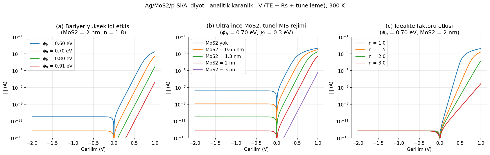

# Ag/MoS₂/p-Si/Al MIS Schottky Diode — Analytical Dark I-V Model

Analytical dark current-voltage model of a metal-insulator-semiconductor (MIS) Schottky diode with an ultrathin MoS₂ interfacial layer, written as an exploratory study during my MSc research on semiconductor devices.



## Physics

The model combines three effects:

- **Thermionic emission** over the effective Schottky barrier φ_b at the Ag/p-Si junction,
- **Tunneling attenuation** by the MoS₂ interfacial layer, following the Card & Rhoderick (1971) MIS treatment — the saturation current is suppressed by `exp(-√χ_t · δ)`, where χ_t is the mean tunnel barrier (eV) and δ the MoS₂ thickness (Å),
- **Series resistance**, handled exactly with the closed-form **Lambert-W solution** of the implicit diode equation `I = I₀[exp(q(V − IR_s)/nkT) − 1]` instead of iterative solving.

The script sweeps barrier height (0.60-0.91 eV), MoS₂ thickness (0-3 nm, where 0.65 nm ≈ 1 monolayer) and ideality factor (1-3), and prints rectification ratios for each thickness.

## Validity limit (why numerical simulation is still needed)

The tunnel-MIS picture only holds for δ ≲ 3 nm. For thicker MoS₂ films, transport crosses over to a heterojunction / drift-diffusion regime where this analytical model breaks down — that regime requires a numerical device simulator (e.g. SCAPS-1D). This script exists to map the ultrathin regime and to justify that transition quantitatively.

## Usage

```
pip install -r requirements.txt
python analitik_model.py
```

Outputs `analitik_iv.png` (three-panel parameter sweep) and a numeric summary to stdout.

## Reference

- H. C. Card, E. H. Rhoderick, *Studies of tunnel MOS diodes I. Interface effects in silicon Schottky diodes*, J. Phys. D: Appl. Phys. **4**, 1589 (1971).

## License

MIT
